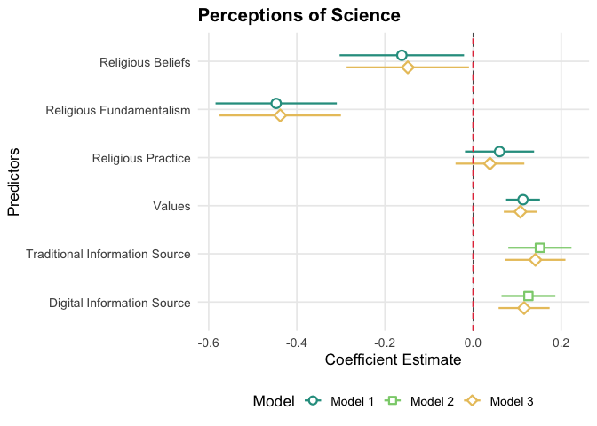
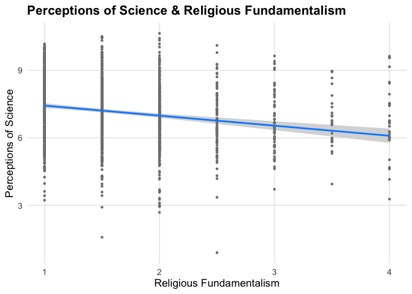
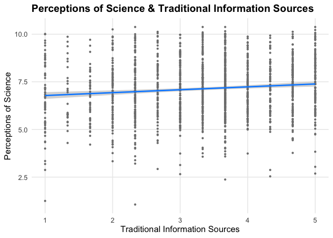

Influence of Religiousity, Values and Information Sources on the
Perceptions of Science
================

The predictors of Religious Fundamentalism and Traditional Information
Source show the strongest statistical significance. Religious
fundamentalism shows a strong negative relationship with attitudinal
perceptions towards science whereas getting information from traditional
information and news sources shows a strong positive relationship with
perceptions towards science. As respondents starts believing in more
exclusionary and fundamentalist ideas of religion, their perceptions
towards science and its benefits seems to go down. The opposite is true
for those who get more of their information and news from traditional
sources like newspapers, tv and radi - their perceptions towards science
and its benefits tend to be more positive.

``` r
library(dplyr)
library(readr)
library(tidyr)
library(ggplot2)
library(visreg)
library(jtools)
```

``` r
wvs <- read.csv("WVS_Cross-National_Wave_7_csv_v6_0.csv")
```

``` r
### Define Variables 
## Science
# Q158 Science and technology are making our lives healthier, easier, and more comfortable
# Q159 Because of science and technology, there will be more opportunities for the next generation
# Q160 We depend too much on science and not enough on faith
# Q161 One of the bad effects of science is that it breaks down people’s ideas of right and wrong
# Q162 It is not important for me to know about science in my daily life
# Q163 The world is better off, or worse off, because of science and technology

## Religious Values
# Q164 Importance of God
#Q165 Believe in: God
# Q166 Believe in: life after death
# Q167 Believe in: hell
# Q168 Believe in: heaven
# Q169 Whenever science and religion conflict, religion is always right
# Q170 The only acceptable religion is my religion
# Q171 How often do you attend religious services
# Q172 How often to you pray
# Q173 Religious person
# Q174 Meaning of religion: To follow religious norms and ceremonies vs To do good to other people
# Q175 Meaning of religion: To make sense of life after death vs To make sense of life in this world

## Ethical Values
# Q182 Justifiable: Homosexuality
# Q184 Justifiable: Abortion
# Q188 Justifiable: Euthanasia

## News and Information Sources  
# Q201 Information source: Daily newspaper
# Q202 Information source: TV news
# Q203 Information source: Radio news
# Q204 Information source: Mobile phone
# Q205 Information source: Email
# Q206 Information source: Internet
#Q207 Information source: Social media (Facebook, Twitter, etc.)

science <- c("Q158", "Q159", "Q160", "Q161", "Q162", "Q163")
religion <- c("Q164", "Q165", "Q166", "Q167", "Q168", "Q169", "Q170", "Q171", "Q172", "Q173", "Q174", "Q175")
values <- c("Q182", "Q184", "Q188")
information <- c("Q201", "Q202", "Q203", "Q204", "Q205", "Q206", "Q207")

analysis_vars <- c("B_COUNTRY_ALPHA", science, religion, values, information)

wvs_country <- wvs %>% 
  select(all_of(analysis_vars)) %>%
  filter(B_COUNTRY_ALPHA == "GBR")
```

``` r
# Clean Data
# missing values from the dataset: -1 = don’t know, -2 = no answer, -3 = not applicable, -4 = not asked, -5 = missing / unavailable

wvs_clean <- wvs_country %>%
  mutate(across(-B_COUNTRY_ALPHA, ~replace(.x, .x %in% c(-1,-2,-3,-4,-5), NA)))
```

``` r
# Reverse Scales

# Reverse code specific variables so all high values have a positive attitude towards science, religion, values, information 
reverse_scale <- function(x, min_value, max_value) {
  ifelse(is.na(x), NA, max_value + min_value - x)
}

wvs_cleaned <- wvs_clean %>%
  mutate(
    #science
    sci_present = Q158, sci_future = Q159, sci_faith = reverse_scale(Q160, 1, 10), sci_morality = reverse_scale(Q161, 1, 10), sci_knowledge = reverse_scale(Q162, 1, 10), sci_world = Q163,
    #religion 
    rel_importance_god = Q164,
    rel_belief_god = case_when(Q165 == 1 ~ 1, Q165 == 2 ~ 0, TRUE ~ NA_real_),
    rel_belief_afterlife = case_when(Q166 == 1 ~ 1, Q166 == 2 ~ 0, TRUE ~ NA_real_),
    rel_belief_hell = case_when(Q167 == 1 ~ 1, Q167 == 2 ~ 0, TRUE ~ NA_real_),
    rel_belief_heaven = case_when(Q168 == 1 ~ 1, Q168 == 2 ~ 0, TRUE ~ NA_real_),
    rel_sci_conflict = reverse_scale(Q169, 1, 4),
    rel_only_religion = reverse_scale(Q170, 1, 4),
    rel_attendance = reverse_scale(Q171, 1, 7),
    rel_pray = reverse_scale(Q172, 1, 8),
    rel_identity = case_when(
      Q173 == 1 ~ 2,
      Q173 == 2 ~ 1,
      Q173 == 3 ~ 0,
      TRUE ~ NA_real_
    ),
    #values
    ethics_homosexuality = Q182, ethics_abortion = Q184, ethics_euthanasia = Q188,
    #information
    info_newspaper = reverse_scale(Q201, 1, 5),
    info_tv_news = reverse_scale(Q202, 1, 5),
    info_radio_news = reverse_scale(Q203, 1, 5),
    info_mobile = reverse_scale(Q204, 1, 5),
    info_email = reverse_scale(Q205, 1, 5),
    info_internet = reverse_scale(Q206, 1, 5),
    info_social_media = reverse_scale(Q207, 1, 5)
  )
```

``` r
## group variables together as blocks based on what they measure 
wvs_regression <- wvs_cleaned %>%
  mutate(
    science_perceptions = rowMeans(select(., sci_present, sci_future, sci_faith, sci_morality, sci_knowledge, sci_world), na.rm = FALSE),
    religious_beliefs = rowMeans(select(., rel_importance_god, rel_belief_god, rel_belief_afterlife, rel_belief_hell, rel_belief_heaven,), na.rm = FALSE),
    religious_fundamentalism = rowMeans(select(., rel_sci_conflict, rel_only_religion), na.rm = FALSE),
    religious_practice = rowMeans(select(., rel_attendance, rel_pray, rel_identity), na.rm = FALSE),
    values = rowMeans(select(., ethics_homosexuality, ethics_abortion, ethics_euthanasia), na.rm = FALSE),
    traditional_info_source = rowMeans(select(., info_newspaper, info_tv_news, info_radio_news), na.rm = FALSE),
    digital_info_source = rowMeans(select(., info_mobile, info_email, info_internet, info_social_media), na.rm = FALSE)
  ) %>%
  select(science_perceptions, religious_beliefs, religious_fundamentalism, religious_practice, values, traditional_info_source, digital_info_source) %>%
  drop_na()
```

``` r
lm1 <- lm(science_perceptions ~ religious_beliefs + religious_fundamentalism + religious_practice + values, data = wvs_regression)
summary(lm1)
```

    ## 
    ## Call:
    ## lm(formula = science_perceptions ~ religious_beliefs + religious_fundamentalism + 
    ##     religious_practice + values, data = wvs_regression)
    ## 
    ## Residuals:
    ##     Min      1Q  Median      3Q     Max 
    ## -5.8669 -0.8982 -0.0189  0.9415  3.6585 
    ## 
    ## Coefficients:
    ##                          Estimate Std. Error t value Pr(>|t|)    
    ## (Intercept)               7.10307    0.20255  35.068  < 2e-16 ***
    ## religious_beliefs        -0.16169    0.06616  -2.444   0.0146 *  
    ## religious_fundamentalism -0.44689    0.06405  -6.977 4.48e-12 ***
    ## religious_practice        0.06009    0.03895   1.543   0.1231    
    ## values                    0.11335    0.01788   6.339 3.05e-10 ***
    ## ---
    ## Signif. codes:  0 '***' 0.001 '**' 0.01 '*' 0.05 '.' 0.1 ' ' 1
    ## 
    ## Residual standard error: 1.376 on 1513 degrees of freedom
    ## Multiple R-squared:  0.1301, Adjusted R-squared:  0.1278 
    ## F-statistic: 56.55 on 4 and 1513 DF,  p-value: < 2.2e-16

``` r
lm2 <- lm(science_perceptions ~ traditional_info_source + digital_info_source, data = wvs_regression)
summary(lm2)
```

    ## 
    ## Call:
    ## lm(formula = science_perceptions ~ traditional_info_source + 
    ##     digital_info_source, data = wvs_regression)
    ## 
    ## Residuals:
    ##     Min      1Q  Median      3Q     Max 
    ## -5.9204 -1.0482  0.0318  1.0164  3.3937 
    ## 
    ## Coefficients:
    ##                         Estimate Std. Error t value Pr(>|t|)    
    ## (Intercept)              6.12685    0.16018  38.251  < 2e-16 ***
    ## traditional_info_source  0.15165    0.03447   4.400 1.16e-05 ***
    ## digital_info_source      0.12564    0.03097   4.057 5.23e-05 ***
    ## ---
    ## Signif. codes:  0 '***' 0.001 '**' 0.01 '*' 0.05 '.' 0.1 ' ' 1
    ## 
    ## Residual standard error: 1.457 on 1515 degrees of freedom
    ## Multiple R-squared:  0.02445,    Adjusted R-squared:  0.02316 
    ## F-statistic: 18.99 on 2 and 1515 DF,  p-value: 7.171e-09

``` r
lm3 <- lm(science_perceptions ~ religious_beliefs + religious_fundamentalism + religious_practice + values + traditional_info_source + digital_info_source, data = wvs_regression)
summary(lm3)
```

    ## 
    ## Call:
    ## lm(formula = science_perceptions ~ religious_beliefs + religious_fundamentalism + 
    ##     religious_practice + values + traditional_info_source + digital_info_source, 
    ##     data = wvs_regression)
    ## 
    ## Residuals:
    ##     Min      1Q  Median      3Q     Max 
    ## -5.7008 -0.9397  0.0020  0.9199  3.7842 
    ## 
    ## Coefficients:
    ##                          Estimate Std. Error t value Pr(>|t|)    
    ## (Intercept)               6.27289    0.24244  25.874  < 2e-16 ***
    ## religious_beliefs        -0.14816    0.06547  -2.263   0.0238 *  
    ## religious_fundamentalism -0.43769    0.06349  -6.894 7.96e-12 ***
    ## religious_practice        0.03824    0.03879   0.986   0.3243    
    ## values                    0.10742    0.01772   6.063 1.69e-09 ***
    ## traditional_info_source   0.14146    0.03253   4.348 1.47e-05 ***
    ## digital_info_source       0.11579    0.02900   3.993 6.83e-05 ***
    ## ---
    ## Signif. codes:  0 '***' 0.001 '**' 0.01 '*' 0.05 '.' 0.1 ' ' 1
    ## 
    ## Residual standard error: 1.361 on 1511 degrees of freedom
    ## Multiple R-squared:  0.1508, Adjusted R-squared:  0.1474 
    ## F-statistic: 44.73 on 6 and 1511 DF,  p-value: < 2.2e-16

``` r
coeff_names <- c("Religious Beliefs" = "religious_beliefs", "Religious Fundamentalism" = "religious_fundamentalism", "Religious Practice" = "religious_practice", "Values" = "values", "Traditional Information Source" = "traditional_info_source", "Digital Information Source" = "digital_info_source")

fig1 <- plot_summs(lm1, lm2, lm3, robust = "HC3", coefs = coeff_names,colors = c("#2A9D8F", "#8BCF7B", "#E9C46A")
) +
  geom_vline(xintercept = 0, linetype = "dashed", color = "#E63946") +
    theme_minimal(base_size = 13) + theme(
    legend.position = "bottom",
    panel.grid.minor = element_blank(),
    plot.title = element_text(face = "bold")
  ) +
  labs(
    title = "Perceptions of Science",
    x = "Coefficient Estimate",
    y = "Predictors"
  )

fig1
```

<!-- -->

``` r
fig2 <- visreg(lm1, "religious_fundamentalism", gg = TRUE, ylab = "Perceptions of Science", xlab = "Religious Fundamentalism") +
  theme_minimal(base_size = 13) + theme(
    panel.grid.minor = element_blank(),
    plot.title = element_text(face = "bold")) +
      labs(title = "Perceptions of Science & Religious Fundamentalism")
```

    ## Warning: `aes_string()` was deprecated in ggplot2 3.0.0.
    ## ℹ Please use tidy evaluation idioms with `aes()`.
    ## ℹ See also `vignette("ggplot2-in-packages")` for more information.
    ## ℹ The deprecated feature was likely used in the visreg package.
    ##   Please report the issue at <https://github.com/pbreheny/visreg/issues>.
    ## This warning is displayed once per session.
    ## Call `lifecycle::last_lifecycle_warnings()` to see where this warning was
    ## generated.

    ## Warning: Using `size` aesthetic for lines was deprecated in ggplot2 3.4.0.
    ## ℹ Please use `linewidth` instead.
    ## ℹ The deprecated feature was likely used in the ggplot2 package.
    ##   Please report the issue at <https://github.com/tidyverse/ggplot2/issues>.
    ## This warning is displayed once per session.
    ## Call `lifecycle::last_lifecycle_warnings()` to see where this warning was
    ## generated.

``` r
fig2
```

<!-- -->

``` r
fig3 <- visreg(lm2, "traditional_info_source", gg = TRUE, ylab = "Perceptions of Science", xlab = "Traditional Information Sources") +
  theme_minimal(base_size = 13) + theme(
    panel.grid.minor = element_blank(),
    plot.title = element_text(face = "bold")) +
  labs(title = "Perceptions of Science & Traditional Information Sources")
fig3
```

<!-- -->
